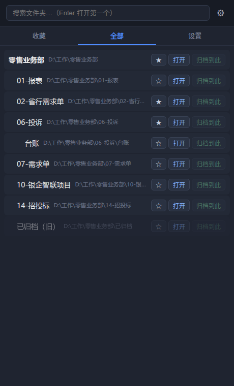

# FolderPilot 文件夹快速跳转

Windows 悬浮文件夹管理与一键归档工具。基于 Tauri 2（Rust + Web 前端），在 Linux 上开发、通过 GitHub Actions 在 Windows 上打包。

## UI 预览

| 收藏 | 全部 | 设置 |
| --- | --- | --- |
|  |  |  |

## 功能

- 悬浮置顶面板，系统托盘 + 全局热键（默认 `Alt+Shift+F`）呼出
- 收藏夹 + 自动扫描多个根目录（可配置深度）快速定位文件夹
- 点击「打开」/双击即在系统资源管理器中打开文件夹
- 一键归档：选择文件 → 点击「归档到此」快速移动，同名自动追加序号不覆盖
- 失效目录自动置灰标记
- 配置存于 `%APPDATA%\folder-pilot\config.json`

## 本地开发

```bash
npm install
npm run tauri dev
```

> 本仓库主流程在 Linux 上开发，Tauri 原生层需要 webkit2gtk 系统库；
> 最终 Windows 包通过 GitHub Actions 构建。

## Windows 打包（GitHub Actions）

1. 推送代码到 GitHub 仓库 `main` 分支
2. 打包工作流在 `.github/workflows/build.yml`：
   - 推 `v*` 标签或 `main` 分支即触发（也可手动 `workflow_dispatch`）
   - 产物：NSIS 安装包（`.exe`）与 MSI 包，上传为 artifact

```bash
# 打标签触发发布构建（可选）
git tag v0.1.0
git push origin v0.1.0
```

## 目录结构

```
src/              前端（TypeScript + Vite）
src-tauri/        Rust 后端
  src/lib.rs      命令注册、托盘、热键、单实例
  src/config.rs   配置读写（收藏、根目录、热键、深度、自启）
  src/scanner.rs  根目录递归扫描
  src/archive.rs  一键归档与资源管理器打开
.github/workflows/build.yml    Windows 打包流水线
```
